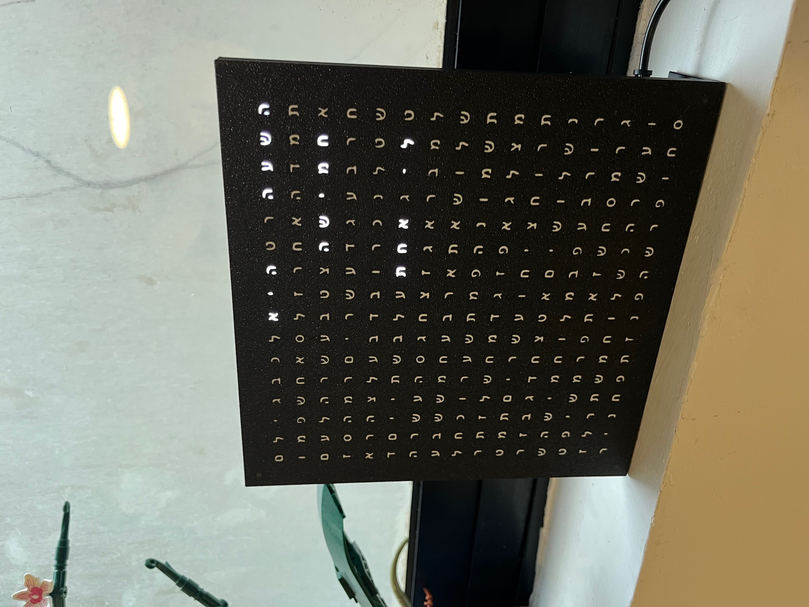
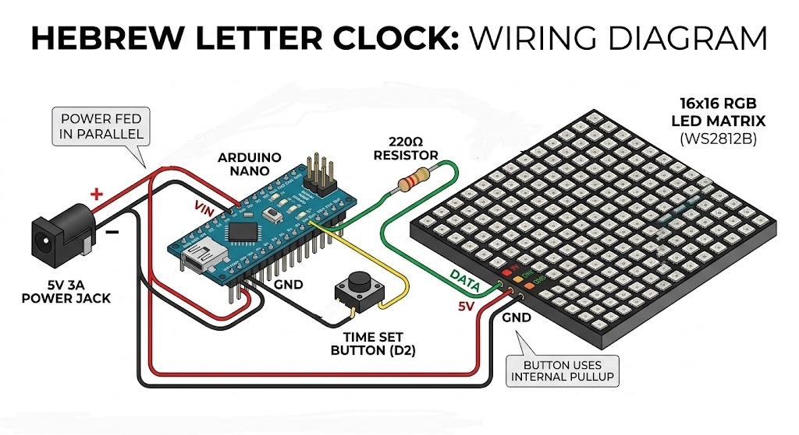
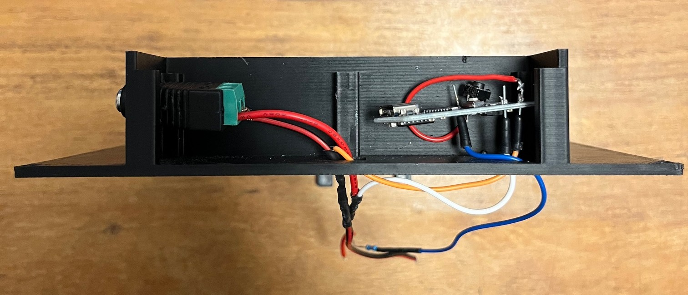
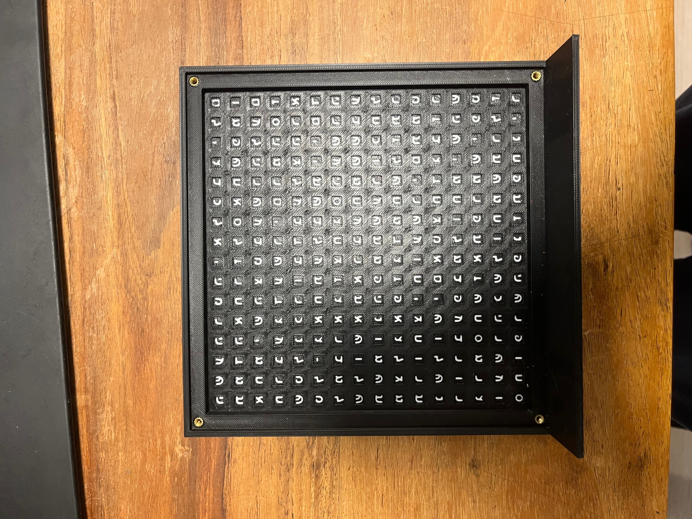
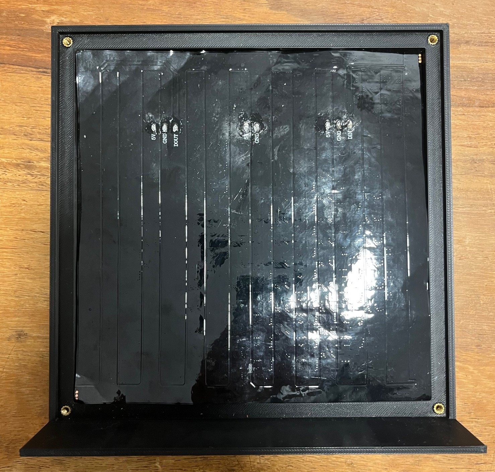
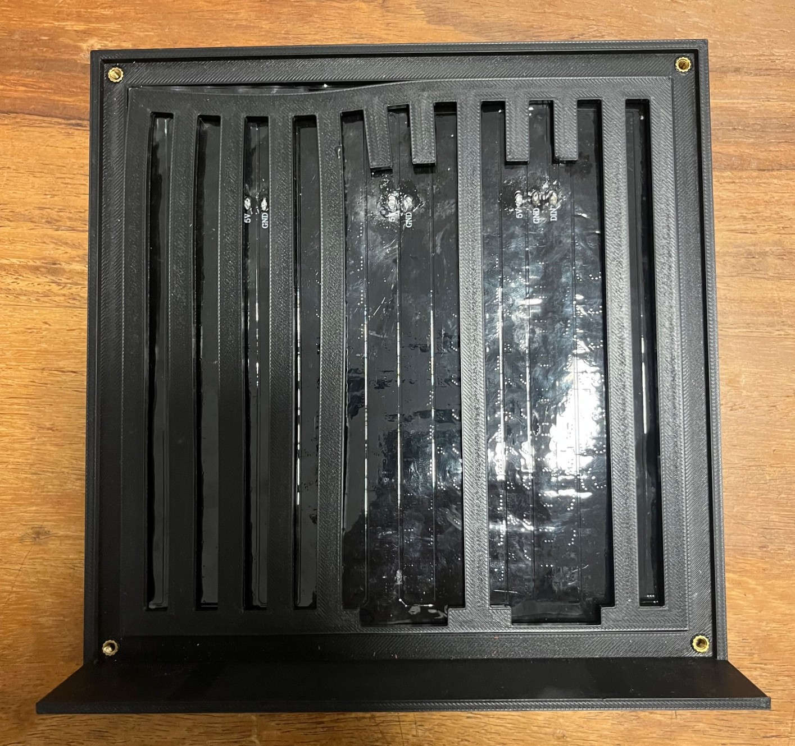
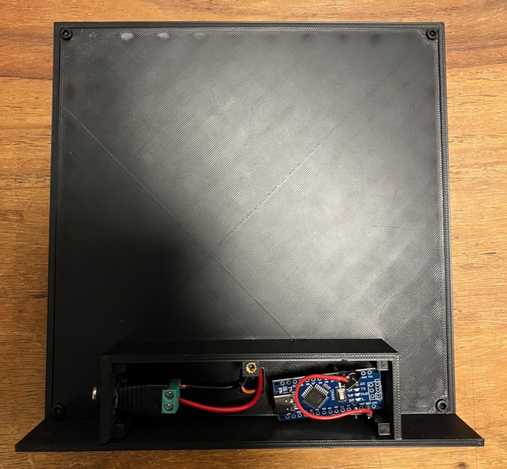

# 🕰️ Hebrew Letter Clock

A sleek, 3D-printed word clock that tells time in Hebrew using an Arduino Nano and a 16x16 RGB LED matrix. This version includes a manual skip button to set the time in 5-minute increments.

---

## 📦 Parts List

### Electronics
| Component | Description | Link |
| :--- | :--- | :--- |
| **LED Matrix** | 16x16 RGB WS2812B LED Matrix | [AliExpress](https://he.aliexpress.com/item/1005003901833984.html) |
| **Microcontroller** | Arduino Nano (ATmega328P) | [AliExpress](https://he.aliexpress.com/item/1005007066680464.html) |
| **Push Button** | Momentary Tactile Button (for time setting) | - |
| **Power Supply** | 5V 3A DC Power Adapter | [AliExpress](https://he.aliexpress.com/item/32961533195.html) |
| **Power Port** | 5.5mm x 2.1mm Female Jack | [AliExpress](https://he.aliexpress.com/item/1005006755773620.html) |
| **Resistor** | 220 Ohm (for LED data line protection) | - |

### Hardware & Tools
* **3D Printer:** (AMS/Multi-material recommended for the front panel)
* **Fasteners:** M3 Screws & M3 Heat-set inserts
* **Wiring:** Jumper wires & [Soldering Tin](https://he.aliexpress.com/item/1005006222917407.html)
* **Tools:** Soldering Iron, Hex keys

---

## 🔌 Wiring Diagram

| From (Component) | Pin | To (Component) | Pin | Notes |
| :--- | :--- | :--- | :--- | :--- |
| **Power Jack** | (+) 5V | **LED Matrix** & **Arduino** | 5V / VIN | Connected in parallel |
| **Power Jack** | (-) GND | **LED Matrix** & **Arduino** | GND | Connected in parallel |
| **Arduino** | **D3** | **LED Matrix** | DIN | Via 220Ω Resistor |
| **Arduino** | **D2** | **Push Button** | Leg 1 | Uses internal `INPUT_PULLUP` |
| **Push Button** | Leg 2 | **Arduino** | **GND** | Completes circuit to Ground |

 

> **Note:** The button does not require an external resistor. The 220Ω resistor should be soldered inline between the Arduino D3 pin and the LED Matrix Data Input to protect the first LED from voltage spikes.

---

## 🏗 Assembly Guide

1. **Front Panel:** Place the 3D-printed front panel face down (letters facing the table).
2. **Inserts:** Press 4 heat-set inserts into the corners of the front panel.

3. **Matrix:** Align the **LED Matrix** on the front panel. Ensure wires are positioned at the bottom.

4. **Grid:** Drop the **Inner Grid** on top of the matrix. This prevents light from "bleeding" into neighboring letters.

5. **Back Panel:** Place the back panel over the grid and thread the matrix wires through the center hole.
6. **Secure:** Screw the back panel into the front panel inserts.
7. **Housing:** Install heat-set inserts for the final back cover.
8. **Electronics:** Mount the **Arduino**, **Power Jack**, and **Push Button** into the rear housing.

9. **Close:** Wire everything up according to the diagram and screw the **Back Cover** shut.

---

## ⚙️ How it Works

* **Automatic Mode:** The clock advances by 5 minutes every 300,000ms (5 minutes).
* **Manual Override:** Pressing the button immediately advances the clock by 5 minutes and **resets** the internal timer.
* **Hebrew Logic:** The hour cycles forward when the minutes reach the 40-minute mark.
* **Debug:** When connected via USB, the Serial Monitor (9600 baud) will print `"test"` every time the button is successfully pressed.

---

## 🛠 Software Requirements

This project requires the following Arduino library:
* `FastLED` 

---

*Created by JeffTheSoldier.*
